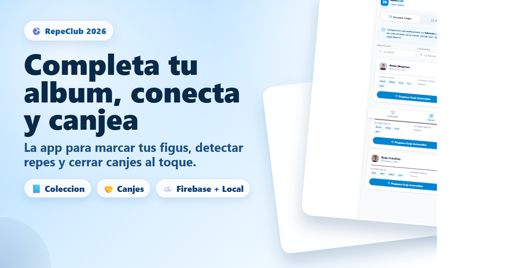
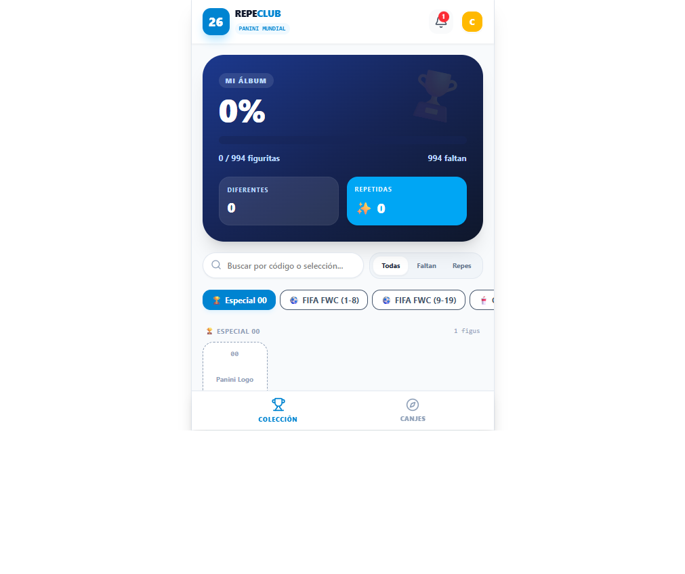
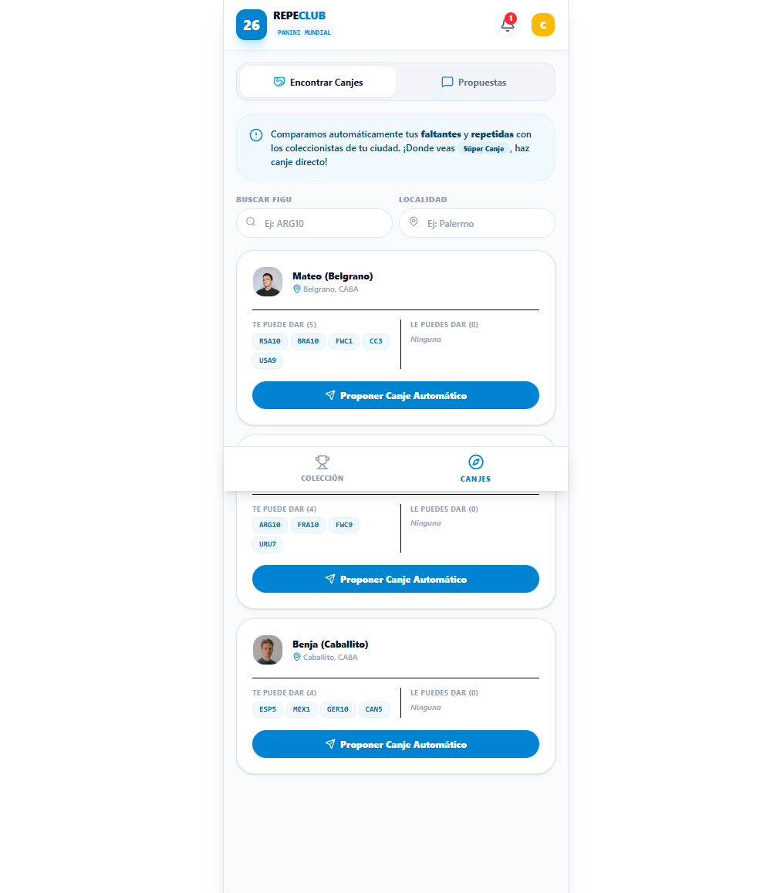

# RepeClub

[](https://app.netlify.com/projects/repeclub/deploys)
[](https://repeclub.digital/)
[](https://harvi.digital/)

> **Tu album, tus repes, tus canjes. Todo en un solo lugar.**
> App web gratuita para coleccionistas del album **Panini FIFA World Cup 26**.
> Produccion: **https://repeclub.digital/**



---

## ⚽ La forma mas simple de completar tu album

RepeClub te ayuda a organizar tu coleccion, detectar repetidas y encontrar canjes con gente cerca tuyo.

### ✨ Highlights

- Inventario completo del album del Mundial 2026.
- Marcado rapido de **faltantes** y **repes** con un toque.
- Busqueda por **codigo, jugador o seleccion**.
- Busqueda por **voz en espanol** (Web Speech API) con coincidencia difusa.
- Modo **"Sumar paquete"**: agrega varias figuritas a la vez.
- Matchmaking automatico de canjes con coleccionistas cerca tuyo.
- Compartir reportes de repes / faltantes por WhatsApp.
- Modo online (Firebase) y modo local / offline para probar sin backend.

---

## Parte 1: para todo publico

### Capturas de la app

#### Vista de coleccion



#### Vista de canjes



### 🎯 Que puedes hacer

- Llevar control de tu album de forma simple.
- Marcar figuritas faltantes y repetidas.
- Ver sugerencias de canje con otros coleccionistas.
- Gestionar propuestas de canje desde la misma app.
- Buscar y agregar figuritas dictando el codigo por voz.

### ⚙️ Como funciona

1. Inicias sesion y creas tu perfil.
2. Cargas tu coleccion: que tienes, que te falta y que te sobra.
3. RepeClub compara tu inventario con otros usuarios.
4. La app te muestra matches de canje utiles.
5. Envian propuesta, coordinan por WhatsApp y listo.

### 🌐 Modos de uso

- **Online (Firebase):** sincroniza tu inventario y canjes entre dispositivos.
- **Local / offline:** prueba la app sin Firebase, guardando datos localmente.

### 🙌 Para quien esta pensada

- Coleccionistas que quieren completar el album mas rapido.
- Amigos, cursos, grupos de barrio o comunidades que canjean seguido.
- Cualquiera que quiera dejar de buscar figuritas a mano en chats.

---

## Parte 2: tecnica

### 🧱 Stack principal

- **Frontend:** React 19 + TypeScript
- **Build tool:** Vite 6
- **UI:** Tailwind CSS 4 + Lucide Icons + Motion
- **Backend / BaaS:** Firebase (Auth + Firestore)
- **OCR / IA:** Tesseract.js + Google GenAI (catalogo asistido)
- **Voz:** Web Speech API (`es-AR`) con fuzzy match Levenshtein
- **Hosting:** Netlify (https://repeclub.digital)

### 🗂️ Estructura general

```
RepeClub/
├─ index.html                   # SEO/AEO/GEO meta + JSON-LD (Org/WebSite/WebApp/FAQ/HowTo)
├─ public/
│  ├─ _redirects                # 301 netlify.app -> repeclub.digital + SPA fallback
│  ├─ robots.txt                # crawlers + AI bots (GPTBot, Perplexity, Claude, etc.)
│  ├─ sitemap.xml               # canonical https://repeclub.digital/
│  └─ llms.txt                  # politica de citacion para LLMs
├─ firebase-blueprint.json      # referencia de entidades / colecciones Firestore
├─ firestore.rules              # reglas de seguridad
└─ src/
   ├─ App.tsx                   # layout principal, onboarding, navegacion
   ├─ context/AppContext.tsx    # estado global usuario / inventario / canjes
   ├─ firebase.ts               # init Firebase + modo fallback offline
   ├─ catalog.ts / stickerData.ts   # catalogo del album
   ├─ components/
   │  ├─ AlbumGrid.tsx          # grilla, busqueda, voz, BatchAddModal
   │  ├─ MatchMaker.tsx         # matchmaking de canjes
   │  ├─ Header.tsx             # perfil, notificaciones, acciones globales
   │  ├─ matchmaker/            # MatchCard, TradeCard, filtros, modales
   │  └─ header/                # NotificationsPanel, ProfilePanel
   ├─ hooks/                    # useMatchmaking, useTradeActions
   └─ utils/voiceSearch.ts      # parser de voz + Levenshtein + alias de prefijos
```

### 🔐 Variables de entorno

Crea `.env.local` a partir de `.env.example` y completa al menos estas variables para habilitar Firebase:

- `VITE_FIREBASE_PROJECT_ID`
- `VITE_FIREBASE_APP_ID`
- `VITE_FIREBASE_API_KEY`
- `VITE_FIREBASE_AUTH_DOMAIN`
- `VITE_FIREBASE_FIRESTORE_DATABASE_ID`
- `VITE_FIREBASE_STORAGE_BUCKET`
- `VITE_FIREBASE_MESSAGING_SENDER_ID`
- `VITE_FIREBASE_MEASUREMENT_ID`

Si no defines estas variables, la app arranca en modo local / offline.

### 🛠️ Scripts disponibles

| Script            | Descripcion                                       |
|-------------------|---------------------------------------------------|
| `npm run dev`     | Entorno local en `http://localhost:3000`          |
| `npm run build`   | Build de produccion en `dist/`                    |
| `npm run preview` | Sirve localmente el build generado                |
| `npm run lint`    | Chequeo de tipos (`tsc --noEmit`)                 |

### 🚀 Levantar el proyecto en local

```bash
npm install
cp .env.example .env.local        # PowerShell: Copy-Item .env.example .env.local
# completa los VITE_FIREBASE_* en .env.local
npm run dev
```

### ☁️ Despliegue

Produccion actual: **Netlify** sirviendo `https://repeclub.digital/`.
Estado de los deploys: ver el badge al inicio del README.

#### Configuracion en Netlify

- **Build command:** `npm run build`
- **Publish directory:** `dist`
- **Environment variables:** todas las `VITE_FIREBASE_*` en Site settings → Environment variables
- **Primary domain:** `repeclub.digital`
- **Redirects:** `public/_redirects` fuerza 301 desde `repeclub.netlify.app` y `www.repeclub.digital` al dominio canonico, ademas del SPA fallback `/* → /index.html 200`.

#### Alternativa: Vercel

1. Importa el repo en Vercel.
2. Build command: `npm run build`. Output: `dist`.
3. Carga las variables `VITE_FIREBASE_*` en Project Settings → Environment Variables.

### 🔎 SEO / AEO / GEO

La home esta optimizada para buscadores tradicionales y motores de respuesta basados en LLM:

- `index.html` con `lang="es-AR"`, canonical a `https://repeclub.digital/`, hreflang, Open Graph y Twitter Card.
- JSON-LD `@graph` con `Organization`, `WebSite`, `WebApplication`, `FAQPage` y `HowTo`.
- `<noscript>` con contenido indexable de respaldo (titulos, features y FAQ minima).
- `public/sitemap.xml` y `public/robots.txt` apuntando al dominio canonico.
- `public/robots.txt` permite explicitamente `GPTBot`, `ChatGPT-User`, `OAI-SearchBot`, `PerplexityBot`, `ClaudeBot`, `Claude-Web`, `Google-Extended`, `Applebot-Extended`, `CCBot`, `Amazonbot` y `Bytespider`.
- `public/llms.txt` con resumen, glosario (figu / repe / faltante / album / canje), key topics y politica de citacion para LLMs.

### ✅ Checklist de seguridad antes de publicar

- No subir `.env.local` ni secretos.
- Verificar que `.env.example` solo tenga placeholders.
- Revisar `firestore.rules` antes de produccion.
- Rotar claves si alguna vez se expusieron en commits historicos.
- Ejecutar una busqueda rapida de patrones sensibles antes de cada release.

### 🧠 Notas utiles para el equipo

- El nombre del paquete en `package.json` sigue como `react-example`; se puede renombrar si quieren alinear branding.
- Si cambian el modelo de datos, actualicen tambien `firebase-blueprint.json` para mantener documentacion tecnica consistente.
- La busqueda por voz (`src/utils/voiceSearch.ts`) usa alias de prefijos (`USA / USAR / USADO → usa`, `argentina → arg`, `brasil → bra`, etc.) y Levenshtein ≤ 2 para tolerar errores de transcripcion.

---

## 👤 Creditos

Hecho con pasion por **[HARVI](https://harvi.digital/)** · Desarrollo: [@amiretti](https://github.com/amiretti) (CUERVODEV).
